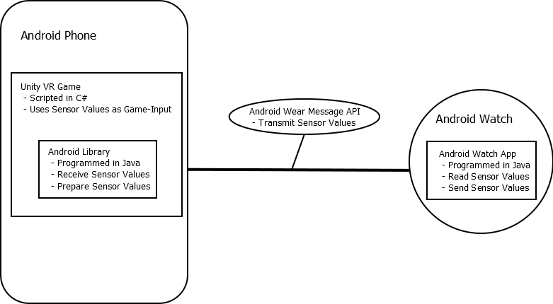
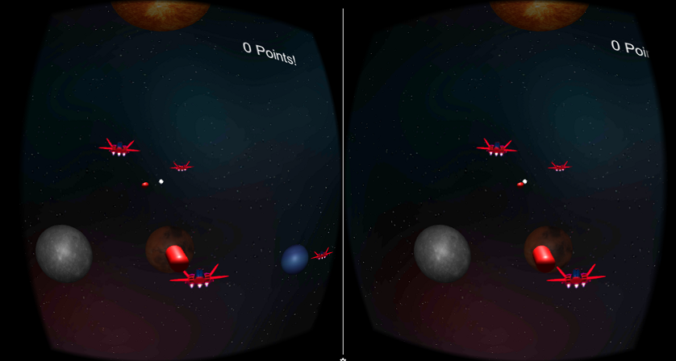

# VRwearSpaceShooter
**Android VR space shooter controlled with a smartwatch**

The goal of this project is to explore some possibilities of how a smartwatch can be used to interact and control a virtual reality environment. The focus is on how to read the input data from a watch, transfer it to the phone and interpret it as controller input for a 3D space. A possible use case of this input mechanisms is demonstrated in a simple 3D virtual reality game. This game uses the smartwatch as input device.

## Info

The problem of simple VR setups (therefore when only using a headset and no other external components) are the limited control mechanisms. One possibility to control the VR application is by using another device an increasingly number of people are using: a smartwatch. In this project, we want to experiment with various input methods of the watch to navigate and control a VR application. We especially want to focus on touch and motion gestures. To demonstrate the input methods, we are building a simple game set in space, in which the user controls a spaceship and fight off incoming asteroids.

### Software
- Android (for the Phone and the Smartwatch)
- Unity Game Engine

We use the Android ecosystem to develop the apps (Android Phone and Android Watch) and the Unity Game Engine to develop the game.

### Hardware
- Google Cardboard
- LG Watch R

### Project Setup

The watch reads sensor values and sends them to an Android library inside the Unity game using the Android Wear Message API. The receiving library passes the values on to an Unity script.



The game is made with the Unity game engine and programmed using C# scripts. To communicate with the watch, the Android Wear API is used. Therefore, a small android library (in Java) is imported into the Unity game and is used to receive the messages from the watch.
The Android App running on the watch that constantly reads the sensor values and sends them to the Android library inside the game on the phone. The library passes the values on to the game.


The App is available on the Google Play Store: https://play.google.com/store/apps/details?id=at.fhooe.pro2



## Communication Between the Smartwatch and the Phone

- Create a new Android Studio Project (a normal phone app project)
- Add a new module: File -> New -> New Module -> Android library<br>
  (named ‘sensorvaluesreceiverlib’)
- (Remove the phone app module so that only the library module is left)
- Copy the file *unityvractivity.jar* from *gvr-unity-sdk-master\Samples\CardboardDesignLab\ustwo-cardboard-unity\Assets\Plugins\Android* into to module and add the jar as library dependency. Add the jar file directly into the module directory and not into the provided ‘lib’ folder and add the dependency as *provided* not as *compile*.

- Create a new Activity and inherit from *GoogleUnityActivity*:

```
import android.os.Bundle;
import android.util.Log;

import com.google.unity.GoogleUnityActivity;

public class MyGoogleUnityActivity extends GoogleUnityActivity {

    @Override
    protected void onCreate(Bundle savedInstanceState) {

        super.onCreate(savedInstanceState);

        Log.d("MyGoogleUnityActivity", "Activity 'MyGoogleUnityActivity' created");
    }
}
```
- Add the following dependency to the module:<br>
`com.google.android.gms:play-services-wearable:9.8.00`

- Create a class that implements the '*MessageApi.MessageListener* interface to listen to Android Wear API Messages:

```
import android.util.Log;
import com.google.android.gms.wearable.MessageApi;
import com.google.android.gms.wearable.MessageEvent;
import java.nio.ByteBuffer;

public class SensorValuesMessageListener implements MessageApi.MessageListener {
    @Override
    public void onMessageReceived(MessageEvent messageEvent) {
        Log.d("MessageListener", "Incomming data";
    }
}
```

- Register the intent filter for the service in the manifest.xml file:

```
<service android:name=".SensorValuesMessageListener">
<intent-filter>
    <action android:name="com.google.android.gms.wearable.BIND_LISTENER"/>
</intent-filter>
</service>
```

- In the Activity, wire up the Wearable Message API:

```
private GoogleApiClient mApiClient;

protected void onCreate(Bundle savedInstanceState) {

    super.onCreate(savedInstanceState);

    mApiClient = new GoogleApiClient.Builder(this)
            .addApi(Wearable.API)
            .addConnectionCallbacks(this)
            .build();

    mApiClient.connect();

    Log.d(LOG_TAG, "this is my test class");
}

public void onConnected(@Nullable Bundle bundle) {
    Log.d(LOG_TAG, "onConnected!");

    Wearable.MessageApi.addListener( mApiClient, new SensorValuesMessageListener() );
}

public void onConnectionSuspended(int i) {
    Log.d(LOG_TAG, "myconnectionsuspended!");
}
```


- Copy the Unity Android classes (the jar file containing these classes) found in *C:\Program Files\Unity\Editor\Data\PlaybackEngines\AndroidPlayer\Variations\mono\Release\Classes\classes.jar* into the module (directly into the module directory and not into the provided *lib* folder), rename it to unity-classes.jar and add it as a dependency (*provided* not *compile*).

- With the UnityPlaer class from the just added jar you can send messages from the android library to the Unity game engine:<br>
`UnityPlayer.UnitySendMessage(..., ..., ...);`

- **Make sure that the unity project and the android library module use the same min-sdk version!**


- Build the android library: the output can be found in build\outputs\aar
- Copy the \*.aar file to the Unity project into the Assets\Plugins\Android folder
- Modify the AndroidManifest.xml from Unity so that your own MainActivity is started instead of the Google VR Activity:<br>
`<activity android:name="at.test.vr.UnityMainActivity" ...>`

- Because we are useing the Android Wear API, we need to add the dependencies we used to build our sensor receiver library to the Unity project. Copy the following files to Assets\Plugins\Android (you will need to rename them):

```
sensorvaluesreceiverlib\build\intermediates\exploded-aar\com.android.support\support-v4\24.0.0\jars\classes.jar
sensorvaluesreceiverlib\build\intermediates\exploded-aar\com.google.android.gms\play-services-base\9.8.00\jars\classes.jar
sensorvaluesreceiverlib\build\intermediates\exploded-aar\com.google.android.gms\play-services-basement\9.8.00\jars\classes.jar
sensorvaluesreceiverlib\build\intermediates\exploded-aar\com.google.android.gms\play-services-wearable\9.8.00\jars\classes.jar
```

- You may need to add this line into the application element of the AndroidManifest.xml:<br>
`<meta-data android:name="com.google.android.gms.version" android:value="9877000" />`

- **The android wear message api can only communicate between apps with the same package name (bundle identifier)!**<br>
Therefore all projects (the Unity project, the Sensorvaluesreceiverlibrary and the Watch App) MUST use the same package name (check the package name in the AndroidManifest.xml and the applicationId in the gradle.build file)!

#### UNITY Project

- Create a new Unity project
- Download the Google VR Unity SDK (https://github.com/googlevr/gvr-unity-sdk)
- Add the GVR Unity Package (File -> Import Package -> Custom)
- Change the project type to Android (File -> Build Settings -> Android -> Switch Platform)
- Open the player settings and set the Android package id
- Eventually change the android:targetSdkVersion to *24* and android:minSdkVersion to *21* in the Assets\Plugins\Android\AndroidManifest.xml

**(Make sure that the unity project and the android library module use the same min-sdk version!)**

#### Watch App

- Add a new Module to the Android Studio Project (Android Wear Module)
- Check if the dependency ‘play-services-wearable:9.8.00’ is referenced
